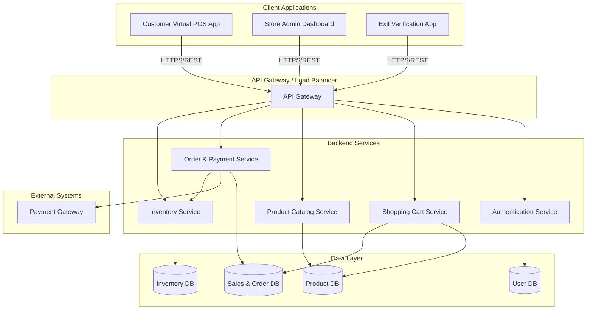
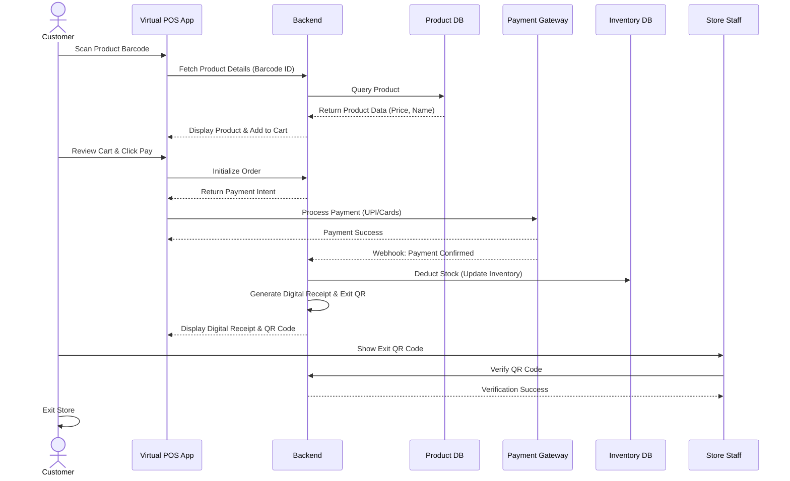

# System Architecture: Eazy Shop (Virtual POS)

## Overview
Eazy Shop (Pay & Go) is a Virtual POS platform that transforms a customer's smartphone into a self-service checkout system. This document outlines the high-level architecture of the system, detailing the interactions between the mobile application, backend services, databases, and third-party integrations (e.g., Payment Gateway).

## High-Level Architecture Diagram

## Component Details

### 1. Customer Virtual POS App (App)
The mobile-first application used by customers in the supermarket.
*   **Responsibilities:**
    *   User Authentication & Store Selection.
    *   Camera-based Barcode Scanning.
    *   Displaying Product Details (retrieved from Backend).
    *   Managing the Local/Live Shopping Cart.
    *   Initiating Checkout and Payment.
    *   Displaying Digital Receipts and Exit QR Codes.

### 2. Backend Services (Backend)
A set of microservices (or a modular monolith) responsible for business logic, data processing, and integration.
*   **Authentication Service:** Manages user registration, login, and session tokens.
*   **Product Catalog Service:** Handles fetching product details based on barcode scans.
*   **Shopping Cart Service:** Manages the state of the user's active shopping session and cart.
*   **Order & Payment Service:** Creates transaction records, calculates final bills, communicates with the payment gateway, and generates digital receipts/QR codes.
*   **Inventory Service:** Updates stock levels in real-time after successful transactions.

### 3. Product Database (Product DB)
The central repository for all items available in the supermarket.
*   **Data Stored:** Product ID (Barcode), Product Name, MRP, Discounted Price, Weight, Image URLs, Category.
*   **Characteristics:** High read-throughput is required since every barcode scan hits this database.

### 4. Payment Integration (Payment)
Integration with a third-party payment aggregator (e.g., Razorpay, Stripe, UPI).
*   **Flow:** The Order Service requests a payment intent/link. The App processes the payment via the Payment Gateway SDK. Webhooks from the Payment Gateway notify the Backend of payment success or failure.
*   **Supported Modes:** UPI, Debit Card, Credit Card, Wallet.

### 5. Inventory Management (Inventory)
The system responsible for tracking stock levels across the store.
*   **Responsibilities:** Deducting items from available stock only *after* a successful payment is confirmed.
*   **Synchronization:** Needs to eventually sync with the supermarket's main ERP/legacy inventory system to maintain a single source of truth.

### 6. Store Admin Dashboard & Exit Verification
*   **Admin Dashboard:** A web portal for store managers to manage the Product DB, view live sessions, track sales analytics, and monitor inventory levels.
*   **Exit Verification:** A specialized application (or feature for staff) to scan the customer's Exit QR Code, validating that the cart is paid for before the customer leaves the premises.

## Data Flow: Shopping & Checkout Sequence

## Recommended Tech Stack (Example)
*   **Frontend (Mobile):** React Native or Flutter (for cross-platform iOS & Android).
*   **Frontend (Admin Web):** React.js or Vue.js.
*   **Backend:** Node.js (Express/NestJS) or Python (FastAPI), or Go (for high performance barcode lookup).
*   **Database:** PostgreSQL (Relational data for Orders/Users) and Redis (Caching Product DB for fast lookups & managing active cart sessions).
*   **Payment Gateway:** Razorpay or Stripe.
